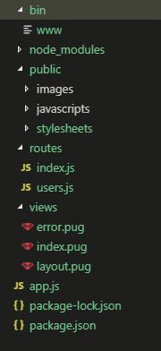

## * Express-generator로 Express 설치하기

### 1. express-generator를 전역 설치  
```
$npm install -g express-generator
```

### 2. 프로젝트 생성
- Express 구조의 프로젝트 생성, pug 템플린 엔진 기반  
```
$express myApp --view=pug
```

### 3. 해당 프로젝트로 이동 및 npm 설치
```
$cd myApp && npm install
```

## Express 기본 구조

