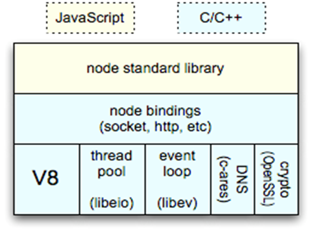
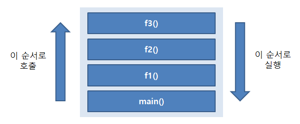

# node
Node.js로 개발한 스터디 및 기록 입니다.  

#### 노드의 특징 간단히  
- 노드는 간단히 말해서 서버 환경에서 실행되는 javascript 기반의 비동기식 스크립트이다.  

## 1.자바스크립트 런타임
- 크롬 v8 자바스크립트 엔진으로 빌드된 자바스크립트 런타임  
- 노드는 자바스크립트 프로그램을 실행할 수 있는 환경을 제공해 준다.  
  

    - node standard library : 자바스크립트 기본 라이브러리  
    - node binding : C와 자바스크립트 바인딩 처리  
    - V8 : 자바스크립트 실행  
    - libeio : 이벤트 기반 비동기로 동작하는 C언어  
    - libev : 다양한 기능을 가진 고성능 이벤트 루프 라이브러리  

## 2. 이벤트 기반  
- 이벤트가 발생할 때 미리 정해둔 작업을 수행한다.  
- 이벤트가 발생하면 이벤트 리스너에 등록된 콜백 func 호출  
  
### - function 호출 순서
```
ex1) func 호출 순서
function f1(){
    f2();
    console.log('첫번째 func');
}
function f2(){
    f3();
    console.log('두번째 func');
}
function f3(){
    console.log('세번째 func');
}
f1();

/*
세번째 func
두번째 func
첫번째 func
*/
```
​  

- 호출스택에 main(), f1(), f2(), f3() 순서로 쌓이고, f3(), f2(), f1(), main() 순서로 실행 된다!  
  

### - setTimeout 함수 실행
```
function setTimeoutFunc(){
    console.log('5초 후 실행');
}
console.log('start');
setTimeout(setTimeoutFunc, 5000);
console.log('end');

/*
start
end
5초 후 실행
*/
```
### setTimeout 호출시 실행 순서 과정
    - 호출스택 -> 백그라운드 -> 태스크 큐  
    - 호출스택 : 먼저 들어온게 나중에 나간다.(FILO 구조)  
    - 백그라운드 : 타이머나 I/O 작업 콜백 또는 이벤트 리스너들이 대기하는 곳  
    - 태스크 큐 : 이벤트 발생 후 호출될 콜백함수들이 기다리는 장소, 이벤트 루프가 지정한 순서대로 기다림  
    - 이벤트 루프 : 이벤트 발생시 호출할 콜백함수들을 관리하고 순서를 지정, 노드가  종료될 때까지 반복 작업  
  

## 3. Non-Blocking I/O 방식  
- 이전 작업이 완료될 때까지 멈추지 않고 다음 작업을 수행  

### * Blocking과 Non-Blocking의 차이점  
- Blocking ≒ 동기 : 이전 작업이 완료되면 다음 작업 수행  
```
//블로킹 방식
function workingFunc(){
    console.log('working!');
}
console.log('start');
workingFunc();
console.log('end');

/*
start
working!
end
*/
```
  
- Non-Blocking ≒ 비동기 : 이전 작업이 완료될 때까지 멈추지 않고 다음 작업을 수행  
```
//논블로킹 방식 - setTimeout 함수 이용
function setTimeoutFunc(){
    console.log('working!');
}
console.log('start');
setTimeout(setTimeoutFunc, 0);
console.log('end');

/*
start
end
working!
*/
```

## 4. 싱글 스레드 방식  
- 주어진 작업을 혼자 처리한다!  

### * 싱글 스레드를 알기 위한 용어 정리
- 프로세스 : 할당하는 작업의 단위, 프로세스 간에 자원 공유 하지 않음  
    ex) 노드, 인터넷 브라우저  
- 스레드 : 프로세스 내에서 실행되는 흐름의 단위, 부모 프로세스의 자원 공유  
    ex) 직원  
-> 하나의 프로세스에 여러개의 스레드를 가질 수 있다.  

​
### * 노드는 싱글 스레드 + 논블로킹 방식
-> 한명의 직원(싱글 스레드)이 여러 개의 일을 순서와 상관없이(논블로킹) 처리  할 수 있다.
  
  
## 5. 멀티 프로세싱 방식  
- 여러 개의 프로세스를 동시에 처리할 수 있다. -> cluster와 pm2에서 이용  


## Node.js의 장단점
#### * 장점 
- 대규모 네트워크 프로그램 개발에 적합  
- 매우 빠른 고성능 서버  
- 프론테엔드와 백엔드 기술을 통합하여 생산성이 높음  
- 개발 관점에서는 빠르고 쉽다.  
  

#### * 단점
- 싱글스레드 기반으므로 작업시간이 길다.  
- 프로그램 전체가 영향을 받음  
- 운영 관점에서는 테스트, 장애 대응, 디버깅에 대해 신경써야함  

​