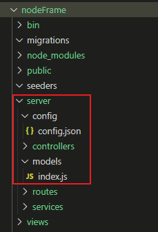

## sequelize란? 
- ORM(Object Relational Mapping)의 한 종류로 객체와 데이터베이스의 관계를 매핑시켜주는 라이브러리  

### 시퀄라이즈에 필요한 sequelize와 mysql2 패키지 설치하기
​```
$cd nodeFrame               //해당 프로젝트로 이동
$npm i sequelize -g sequelize-cli
$npm i sequelize mysql2
$sequelize init             //명령어 호출시 config, models, migrations, seedrs 폴더 생성
```
- sequelize init 명령어 호출시 config, models, migrations, seeders 폴더 생성  
- 기본적인 폴더 구조는 프로젝트 바로 아래 4개의 폴더가 생성 됐지만, 서버 관련 파일들은 server로 따로 이동


- 기본 Sequelize 폴더 구조  


- 변경한 Sequelize 폴더 구조  

### config : db 관련 정보 설정  
- development : 개발 환경 설정  
- test : 테스트 환경 설정  
- production : 실사용 환경 설정  
```
{
  "development": {
    "username": "유저 계정",
    "password": "비밀번호",
    "database": "데이터베이스명",
    "host": "서버주소",
    "dialect": "mysql",    //데이터베이스 종류
    "logging": true,       //로그 설정
    "timezone": "+09:00" , //한국시간으로 재설정
    "pool": {              //connection pool
      "max": 1,            //최대 커넥션 수
      "min": 1,            //최소 커넥션 수
      "idle": 10000,       //커넥션 대시 시간
      "acquire": 30000     //???
    }
  },
  "test": {
    "username": "root",
    "password": null,
    "database": "database_test",
    "host": "127.0.0.1",
    "dialect": "mysql"
  },
  "production": {
    "username": "유저 계정",
    "password": "비밀번호",
    "database": "데이터베이스명",
    "host": "서버주소",
    "dialect": "mysql",
    "logging": true,
    "timezone": "+09:00" ,
    "pool": {
      "max": 1,
      "min": 1,
      "idle": 10000,
      "acquire": 30000
    }
  }
}
```

### models : mysql 테이블과 시퀄라이즈 모델 연결 설정  
- index.js : DB 모델 기본 설정  
- config 파일에서 설정한 development || test || production 중 하나 설정  
- user 모델 imort  
  
#### /server/models/index.js : DB 모델 기본 설정  
```
... 생략
const env = process.env.NODE_ENV || 'development';
... 생략
db.User = require('./user')(sequelize, Sequelize);
```

####  /server/models/user.js : 모델 정의   
```
module.exports = (sequelize, DataTypes) => {
    return sequelize.define('user', {
        user_id: {
            type: DataTypes.INTEGER(11),
            allowNull: false,
            primaryKey: true,
            autoIncrement: true,
        },
        id: {
            type: DataTypes.STRING(20),
            allowNull: false,
        },
        password: {
            type: DataTypes.STRING(100),
            allowNull: true,
        },
        secretkey: {
            type: DataTypes.STRING(100),
            allwoNull: true,
        },
        reg_date: {
            type: DataTypes.DATE,
            allowNull: true,
            //defaultValue: sequelize.literal('now()'),
            defaultValue: DataTypes.NOW,
        },
        mod_date: {
            type: DataTypes.DATE,
            allowNull: true,
            //defaultValue: sequelize.literal('now()'),
            //defaultValue: DataTypes.NOW,
        },
        deleted: {
            type: DataTypes.INTEGER(11),
            allowNull: true,
            defaultValue: 0,
        },
        del_date: {
            type: DataTypes.DATE,
            allowNull: true,
            //defaultValue: sequelize.literal('now()'),
            //defaultValue: DataTypes.NOW,
        },
    }, {
        tableName: 'USER_TB',   //실제 db 테이블명
        timestamps: false,      //createAt, updateAt 컬럼 자동 생성 속성
        paranoid: false,        //deleteAt 컬럼 자동 생성 속성, timestamps이 true일 때문 사용 가능
        underscored: true,      //컬럼 이름 underscore/camelCase로 할지
        freezeTableName: true,  //false면 define 메서드의 첫번째 파라미터 값으로 테이블명을 자동 변환한다.
        //comment: '',          //테이블 comment
    });
}
```

##### * 컬럼 속성  
- type : 데이터 타입  
- allowNull : null 허용  
- primaryKey : 기본키 설정  
- autoIncrement : 자동증가 속성  
- defaultValue : 기본값 설정  
  

##### * 테이블 속성  
- tableName : 실제 db 테이블명  
- timestamps : createAt, updateAt 컬럼 자동 생성 속성  
- paranoid : deleteAt 컬럼 자동 생성 속성, timestamps가 true 때 사용 가능  
- underscored : 컬럼명 underscored/camelCase로 할지 여부  
- freezeTableName : false면 define 메서드의 첫번째 파라미터 값으로 테이블명을 자동 변환  
- comment : 테이블 comment  
  

### app.js 설정
- 시퀄라이즈로 mysql 연동하기  
```
const sequelize = require('./server/models').sequelize;   //require('./server/models/index.js') index.js 생략
sequelize.sync();
```


