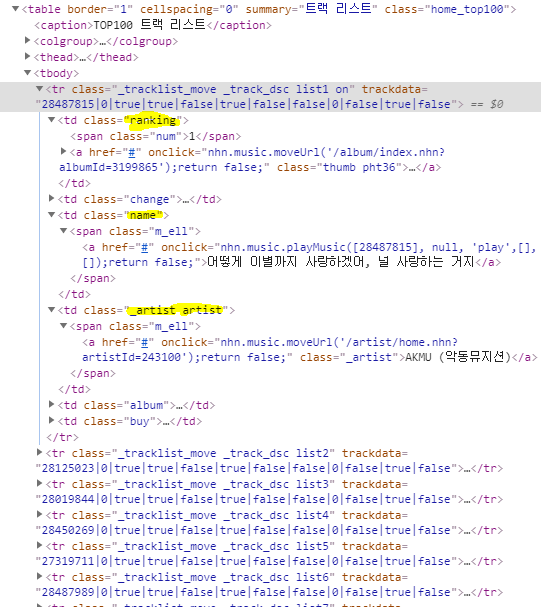
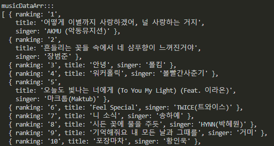

## web crawling  

### 크롤링(crawling)  
- 웹 사이트의 데이터를 수집해오는 기술이다.  

### 웹 크롤링을 쉽게 도와주는 모듈  
- axios : 웹 사이트의 HTML을 가져오는 모듈  
- cheerio : jQuery와 같이 DOM Selector 기능 제공하는 모듈  

### axios, cheerio 설치하기  
```
$ npm i axios cheerio
```

### axios와 cheerio를 사용하여 네이버 뮤직의 순위를 웹 크롤링 하기  
- 태그 위치 확인하기  
  
  
### 각각의 데이터에 해당하는 html 태그 selector해서 값 가져오기
```
const axios = require('axios');
const cheerio = require('cheerio');

let html = await axios.request({
    method: 'GET',
    url: 'https://music.naver.com/',
});

const $ = cheerio.load(html.data, {
    decodeEntities: false
});

//음악 리스트 tr
const $musicList = $('._top100_content .home_top100 tbody').children('tr._tracklist_move');

//음악 데이터가 담길 배열
let musicDataArr = new Array();
$musicList.each(function(i, e){
    musicDataArr[i] = {
        ranking : $(this).find('.ranking .num').text().trim(),  //순위
        title : $(this).find('.name a').text().trim(),          //제목
        singer : $(this).find('._artist a').text().trim(),      //가수
    };
});

console.log('musicDataArr:::');
console.log(musicDataArr);
```

### 결과 값
  
  
  
- 단, 웹 사이트에서 제공하기 원치않은 데이터를 수집한다면 법적 문제가 있을 수 있고,  
  크롤링시 정보를 제공하는 사이트 웹 서버의 트래픽이 증가하여 서버에 무리가 갈 수 있으니,  
  API를 통해서 정보를 가져오는게 가장 좋은 방법이다!  
  
  
### 데이터 출처 : [네이버 뮤직](https://music.naver.com/)