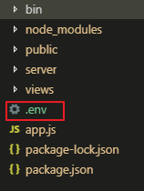

## env 환경변수 설정

### dotenv 설치
```
$npm i dotenv
```

### 프로젝트 아래에 .env 파일 만들기


### .env 파일에 환경변수 등록
```
#데이터베이스
DATABASE=myapp
USERNAME=root
PASSWORD=1234
HOST=127.0.0.1
```

### 환경변수 사용
```
require('dotenv').config();

process.env.DATABASE
process.env.USERNAME
process.env.PASSWORD
process.env.HOST
```