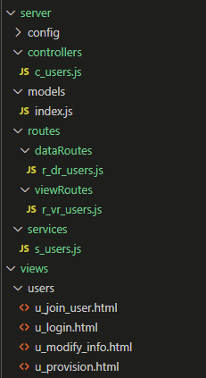

## * MRCS(Models - Routes - Controllers - Services) 패턴
- Models :  DB 관련 모델링 적용  
- Routes : 데이터 및 뷰 페이지 라우팅 
    - dataRoutes : 데이터 로직을 처리하기 위해 view와 controller를 연결해주는 작업
    - viewRoutes : view 페이지 이동 관련 라우터 작업
- Controllers : 어플리케이션의 로직 처리
- Services : 데이터베이스 관련 쿼리 및 작성 로직 처리
- Views : view 페이지

​  
  
  
### viewRoutes : view 페이지 이동 관련
```
/* GET users listing. */
... 생략
router.get('/:id', function(req, res, next){    //로그인 여부에 따라 접근 가능한 페이지 미들웨어 func

    //세션 체크
    mdlwrLogged.sessionChk(req, res, next);
    
    //로그인 여부에 따라 접근 가능한 페이지 미들웨어 func
    ... 생략

}, function(req, res) {
    const urlParamId = req.params.id;  //넘어온 url id

    let deviceType = req.device.type.toUpperCase(); //device type
    if( deviceType === 'DESKTOP' ){
        deviceType = 'web';
    }else if( ['TABLET', 'PHONE'].includes(deviceType) ){
        deviceType = 'mobile';
    }else {
        deviceType = 'web';
    }//if
    
    let fileName;               //파일명

    //객체 리터럴로 urlParamId 값과 파일명 매핑
    const objUrlId = {
        'joinUser' : 'u_join_user',             //유저 가입 페이지
        'modifyUserInfo' : 'u_modify_info',      //유저 정보 수정 페이지
        'provision' : 'u_provision',            //이용약관 보기 페이지
        'login' : 'u_login',                    //로그인 페이지
    }

    //Object.entries(objUrlId) : 객체 -> 배열
    fileName = Object.entries(objUrlId).find(function(v){   //객체를 배열로 변환하여 찾음
        //console.log(v[0]);    //index 0은 urlParamId
        //console.log(v[1]);    //index 1은 파일명
        return v[0] === urlParamId;  //배열 값과 넘어온 urlParamId 값과 비교
    })[1];

    console.log('fileName:::'+fileName);

    const readFileUrl = `views/${deviceType}/users/${fileName}.html`;
    
    fs.readFile(readFileUrl, function(err, data){
        res.writeHead(200, {'Content-Type':'text/html; charset=UTF-8'});
        res.end(data);
    });
});

```
  
  
### dataRoutes : 데이터 로직을 처리하기 위해 view와 controller를 연결  
```
... 생략
const userCntrl = require('../../controllers/c_users');

/* 회원가입 */
router.post('/joinUser', function(req, res){
    return userCntrl.joinUser(req, res);
});
... 생략
```
  

### Controllers : 어플리케이션 로직 처리
```
... 생략
const userService = require('../services/s_users');

/* 회원 가입 */
const joinUser = async function(req, res) {
    try {
        ... 생략        
        return await userService.insertUser(req, res);
    }catch(err){
        console.log(err);
    }
}
... 생략
```
  
  
### Services : 데이터베이스 관련 쿼리 및 작성 로직 처리
```
const { User } = require('../models');  //스키마 연결

/* 회원 가입 */
const insertUser = async function(req, res){
    try {

        console.log('회원가입 :::');
        const id = req.body.id;
        const password = req.body.password;
        const name = req.body.name;
        const secretkey = req.body.secretkey;

        User.create({
            id: id,
            password: password,
            name: name,
            secretkey: secretkey,
        }).then( rst => {
            if( rst !== undefined ){
                res.json(1);
            }
        }).catch( err => {
            console.error('err::::');
            console.error(err);
        });
    }catch(err) {
        console.log(err);
    }
};
```
  

### Models :  DB 관련 모델링 적용  
```
module.exports = (sequelize, DataTypes) => {
    return sequelize.define('user', {
        user_id: {
            type: DataTypes.INTEGER(11),
            allowNull: false,
            primaryKey: true,
            autoIncrement: true,
        },
        id: {
            type: DataTypes.STRING(20),
            allowNull: false,
        },
        ... 생략
    }, {
        tableName: 'USER_TB',   //실제 db 테이블명
        ... 생략
    });
}
```