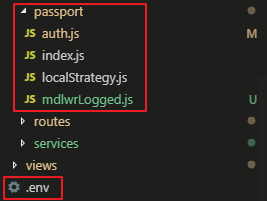

## passport 및 session 설정  
- passport 관련 패키지 설치  
- session 관련 패키지 설치  
- 메시지 관련 패키지 설치  
```
$npm i passport passport-local bcrypt
$npm i express-session
$npm i connect-flash
```
  
### passport 관련 파일 및 env 파일 구조

  
### .env : 환경 변수 설정 파일 / 쿠키 시크릿 암호화로 처리
-    session secret 속성에 process.env.COOKIE_SECRET로 설정  
```
COOKIE_SECRET=nodebirdsecret    //쿠키 값을 암호화 처리
```
  
### app.js  로그인 관련 모듈 선언 및 npm 설치 / .env 환경 설정
```
/* 로그인 관련 모듈 */
const session = require('express-session');
const flash = require('connect-flash');
const passport = require('passport');
require('dotenv').config();   //.env 파일의 환경변수 설정 / 암호화로 처리

const { sequelize } = require('./server/models');   //require('./server/models/index.js').sequelize index.js 생략
const authRouter = require('./server/passport/auth');
const passportConfig = require('./server/passport');      //require('./server/passport/index.js') index.js 생략
sequelize.sync();
passportConfig(passport);

app.use(session({
    resave: true,
    saveUninitialized: false,
    secret: process.env.COOKIE_SECRET,    //.env 파일에서 암호화하여 생성
    cookie: {
        httpOnly: true,
        secure: false,
    },
}));
app.use(flash());
app.use(passport.initialize()); //req 객체에 passport 설정을 심는다.
app.use(passport.session());    //req.session 객체에 passport 정보 저장
/* 로그인 관련 모듈 */
```
  
- * localStrategy.js -> auth.js -> index.js 순서로 실행 / 미들웨어 mdlwrLogged.js

### localStategy.js
- view에서 넘어온 값을 매핑하여 유저 정보 조회 하고 정보 비교 체크  
```
const LocalStrategy = require('passport-local').Strategy;
const bcrypt = require('bcrypt');   //암호화 관련 모듈

const { User } = require('../models');

module.exports = (passport) => {
    passport.use(new LocalStrategy({  //3. passport 전략 수행
        usernameField: 'email',    //view에서 넘어온 email 값
        passwordField: 'password', //view에서 넘어온 password 값
    }, async (email, password, done) => {
        try {
            //유저 정보 조회
            const exUser = await User.findOne({ where: { email: email } });

            if( exUser ){  //유저정보가 있으면

                //비밀번호 해시 비교
                const rst = await bcrypt.compare(password, exUser.password);
                
                if( rst ){  //비밀번호 일치
                    if( exUser.email_athnt !== 1 ){ //이메일 인증 필요
                        done(null, false, { message: 'no_athnt' });
                    }else { //로그인 성공 
                        done(null, exUser);
                    }
                }else { //비밀번호 불일치
                    done(null, false, { message: 'mis_pwd' });
                }
            }else { //회원 정보 없음
                done(null, false, { message : 'no_user' });
            }
            
        }catch (err) {
            console.error(err);
            done(err);
        }
    }));
}
```
  
### auth.js
- login / logout 메서드  
```
const express = require('express');
const router = express.Router();
const passport = require('passport');

const { isLoggedIn, isNotLoggedIn } = require('./mdlwrLogged');  //로그인/아웃 미들웨어
//const { User } = require('../models');

/* 로그인 관련 */
router.post('/login', isNotLoggedIn, (req, res, next) => {  //1. 로그인 요청
    passport.authenticate('local', (authError, user, info) => { //2. passport.authenticate 메서드 호출

        if(authError) {
            return next(authError);
        }

        if( !user ){    //로그인 실패 메시지 리턴
            req.flash('loginError', info.message);
            return res.json(info.message);
        }

        return req.login(user, (loginError) => {    //4. 로그인 성공시 유저 정보를 가지고 req.login 호출
            if(loginError) {
                return next(loginError);
            }
            return res.json(1); //로그인 성공시 값 1 리턴
        });
    })(req, res, next);
});

/* 로그아웃 */
router.get('/logout', isLoggedIn, (req, res) => {
    req.logout();
    req.session.destroy();
    req.redirec('/');
});

module.exports = router;
```
  
  
### index.js
- serializeUser, deserializeUser 메서드 
```
const local = require('./localStrategy');
const { User } = require('../models');

module.exports = (passport) => {  
    //5. passport.serializeUser 호출
    passport.serializeUser((user, done) => {    //Strategy 성공시 호출 / req.session 객체에 담을 데이터
        done(null, user.user_id);    //6. 세션에 user_id만 저장, done(에러, user index 값) / user_id 값이 deserializeUser의 첫번째 매개변수로 이동
    });
    //7. passport.deserializeUser 호출
    passport.deserializeUser((user_id, done) => {   //세션에 저장된 유저 id 값을 통해 유저 정보 get / passport.session() 미들웨어가 호출 / 매개변수 user_id는 serializeUser done의 인자 값으로 받은 것
        User.findOne({where: { user_id } })  //8. user_id 값을 통해 유저 정보 select
        .then( user => done(null, user))    //9. req.user에 정보 저장
        .catch( err => done(err) );
    });

    local(passport);
}
```
  
  
### mdlwrLogged.js  
- 로그인이 된 경우에만 접근 가능한 페이지와 로그인이 안된 경우 접근 가능한 페이지로 구분  
```
const express = require('express');
const router = express.Router();

/*** 로그인 된 여부 체크 미들웨어 ***/
router.isLoggedIn = (req, res, next) => {  //로그인 된 경우에만 접근할 수 있는 것, 회원정보, 회원탈퇴,...
    if( req.isAuthenticated()) {    
        next();
    }else {
        res.status(403).send('로그인 필요');
    }
}

/*** 로그인 안된 여부 체크 미들웨어 ***/
router.isNotLoggedIn = (req, res, next) => {   //로그인이 안된 경우에만 접근할 수 있는 것, 회원가입, 비밀번호 찾기
    if( !req.isAuthenticated() ) {  
        next();
    }else {
        res.status(403).send('이미 로그인');
    }
}

module.exports = router;
```

​